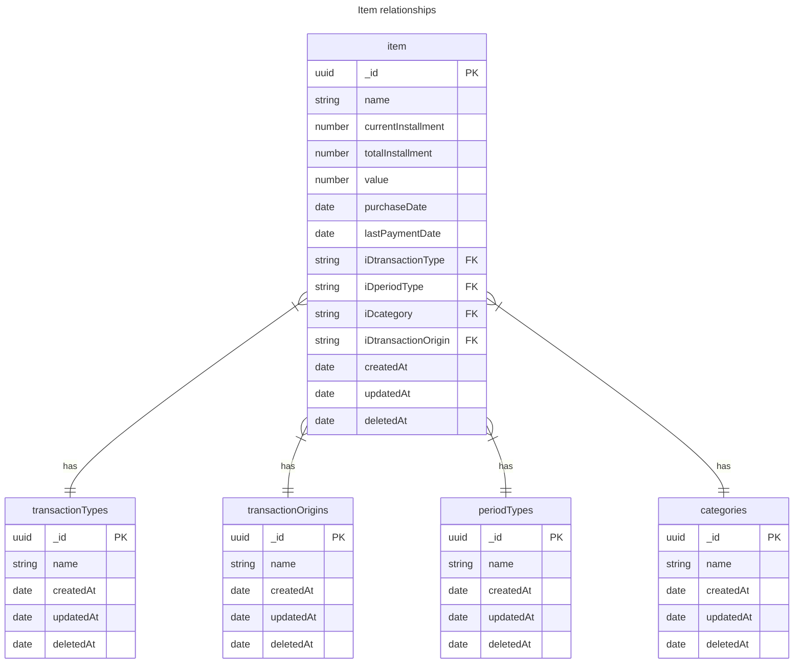

# Jangada API

- NestJS
- PostgreSQL
- TypeORM

Esse projeto seguirá o padrão recomendado pelo NestJS com o adicional de que será organizados em modulos/domínios de contexto, ao invés de separar em várias pastas cada tipo de arquivo.

Por exemplo:

```
domain/
  domain.controler.ts
  domain.controler.spec.ts
  domain.entity.spec.ts
  domain.repository.spec.ts
```

## Database


